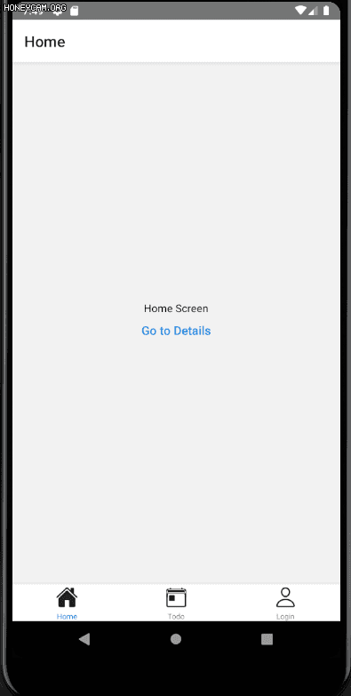

# todoRN
## 실행
- package.json 을 통해 의존 패키지 설치
```shell
$yarn install
```
- android 실행
```shell
$react-native run-android 
```
- ios 실행
```shell
$react-native run-ios
```
## 주요 기능
- ScreenNavigator 
- Todo List
## 화면
### android

### ios

